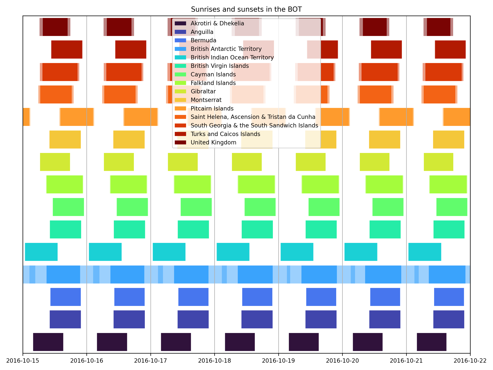

# British Overseas Territories Sunsets (BOTS)

This Python 3.x module contains all the functions required to calculate the sunrises and sunsets of all territories in the [BOT](https://en.wikipedia.org/wiki/British_Overseas_Territories) along with some pretty maps. It uses this data to demonstrate that the sun has not (yet) set over the BOT (thanks to the [Pitcairn Islands](https://en.wikipedia.org/wiki/Pitcairn_Islands) and the [BIOT](https://en.wikipedia.org/wiki/British_Indian_Ocean_Territory), excluding the [BAT](https://en.wikipedia.org/wiki/British_Antarctic_Territory)). This project was inspired by the [What If?](https://what-if.xkcd.com/) blog post [Sunset on the British Empire](https://what-if.xkcd.com/48/).

## Usage

BOTS can be run very easily, below is a minimum working example.

```python
import bots
bots.run(dirOut = "myOutput")
```

## Example Output

All output is saved in `dirOut` which defaults to `BOTSoutput`. BOTS will create a file called [`db.json`](output/db.json) which will make it run quicker the next time you run it. BOTS with also create a PNG image for every territory so that you know where it is in the world. Finally, BOTS will produce a graph (called [`plot.png`](output/plot.png)) which should look like the one below.



The solid coloured bars are the times when the *whole* territory has sunlight and the translucent wings are when *some* of the territory has sunlight. The BAT and [South Georgia & the South Sandwich Islands](https://en.wikipedia.org/wiki/South_Georgia_and_the_South_Sandwich_Islands) have noticeable translucent regions because those territories have large extents.

## Dependencies

BOTS requires the following Python modules to be installed and available in your `PYTHONPATH`.

* [cartopy](https://pypi.org/project/Cartopy)
* [ephem](https://pypi.org/project/ephem)
* [matplotlib](https://pypi.org/project/matplotlib)
* [numpy](https://pypi.org/project/numpy)
* [pyguymer3](https://github.com/Guymer/PyGuymer3)

BOTS uses some [Natural Earth](https://www.naturalearthdata.com/) resources via the [Cartopy](https://scitools.org.uk/cartopy/docs/latest/) module. If they do not exist on your system then Cartopy will download them for you in the background. Consequently, a working internet connection may be required the first time you run BOTS.

## Bugs

* The map for the British Antarctic Territory is wrong: it incorrectly shades the entirety of Antartica red when in reality the BAT only extends from `-80.0` longitude to `-20.0` longitude. However, the final plot of sunrises and sunsets *does not* share this problem as it only uses locations between `-80.0` longitude and `-20.0` longitude.
